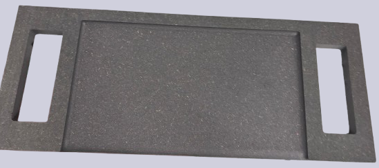
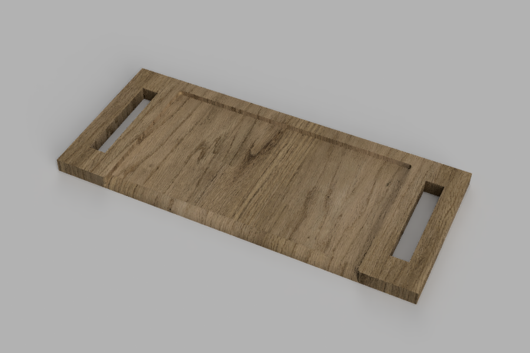

# Tábua de chef

Frase-conceito: Uma tábua de cozinha concebida para combinar funcionalidade, durabilidade e design.

## Conceito

Ao longo do tempo, apercebi-me de que muitas tábuas de cozinha não são tão funcionais quanto aparentam. Por isso, decidi desenvolver uma tábua que combinasse praticidade e facilidade de utilização. O projeto inclui uma ampla área de corte, facilitando a preparação dos alimentos, cantos arredondados para evitar a acumulação de sujidade e uma aresta curva que permite despejar facilmente os resíduos alimentares para o lixo. Além disso, foi concebida para ser fácil de transportar, tornando-a uma solução prática para o dia a dia na cozinha.

## Tecnologias Usadas

Uma ou mais tecnologias estudadas em laboratório:

- [ ] Corte 2D (laser / vinil)
- [ ] Impressão 3D
- [x] CNC
- [ ] Micro:bit / computação física
- [ ] Outras —

Utilizei placa de MDF e a plataforma Fusion.
## Processo

Para inicio deste projeto comecei por encontrar referências de tábuas que me inspirassem e exemplos das quais não queria repetir, por exemplo, tábuas sem pegas nas laterais. Idealizei todo o conceito e estruturei-o para a plataforma Fusion, o mais difícil fora adaptar o meu projeto com o as tábuas em MDF disponíveis no FABLAB da ESELx, as medidas da grossura, comprimento e altura não estavam a bater certo. O seguinte obstáculo foi o preparação do documento para que passa-se para a CNC, algo que aprendi nesse momento foi a dificuldade para esta máquina em CNC de recortar ângulos côncavos e curvos, houve umas ligeiras adaptações, mas sem mudar o projeto final. Por fim, foi apenas o processo de cortar com a CNC. Todo este processo foi bastante interessante, já que nunca tinha tido a possibilidade de trabalhar com estas ferramentas. Gostei imenso do resultado que ficou, embora ter ficado um pouco mais grossa do que pretendia.

Para iniciar este projeto, comecei por pesquisar e analisar diferentes referências de tábuas de cozinha, identificando características que me inspiravam e outras que pretendia evitar. Um dos aspetos que considerei menos práticos  foi a ausência de pegas laterais, o que dificulta o seu manuseamento. Após esta fase de pesquisa, idealizei o conceito da minha tábua e desenvolvi o modelo digital na plataforma Fusion. Um dos maiores desafios foi adaptar o projeto às placas de MDF disponíveis no FABLAB da ESELx, uma vez que as dimensões e a espessura do material não correspondiam exatamente às medidas inicialmente previstas. O obstáculo seguinte foi a preparação do ficheiro para o corte da CNC. Durante este processo, aprendi que a máquina apresenta algumas limitações no corte de ângulos côncavos e curvas muito fechadas, o que exigiu pequenas adaptações ao projeto. No entanto, essas alterações não comprometeram o conceito nem a funcionalidade do projeto final.
Por fim, procedeu-se ao corte da peça na CNC, concluindo assim a fase de fabrico. Todo este processo foi extremamente interessante, sobretudo por ter sido a minha primeira experiência com esta máquina em específico. Fiquei bastante satisfeita com o resultado obtido, apesar de a tábua ter ficado ligeiramente mais espessa do que o inicialmente tinha planeado.

## Resultado Final

Fotografia do resultado final deste projeto.

Renderização do projeto final na plataforma Fusion.

## Reflexão

Para esta mesma ideia e conceito teria feito mais espessa a tábua e umas pegas mais curtas. Embora tenha tentado acompanhar os professores que me auxiliaram durante o processo da preparação do projeto, não fui capaz de entender por completo, tinha interesse em aprofundar mais essa parte em como usar as ferramentas que comandam o que CNC deve fazer.