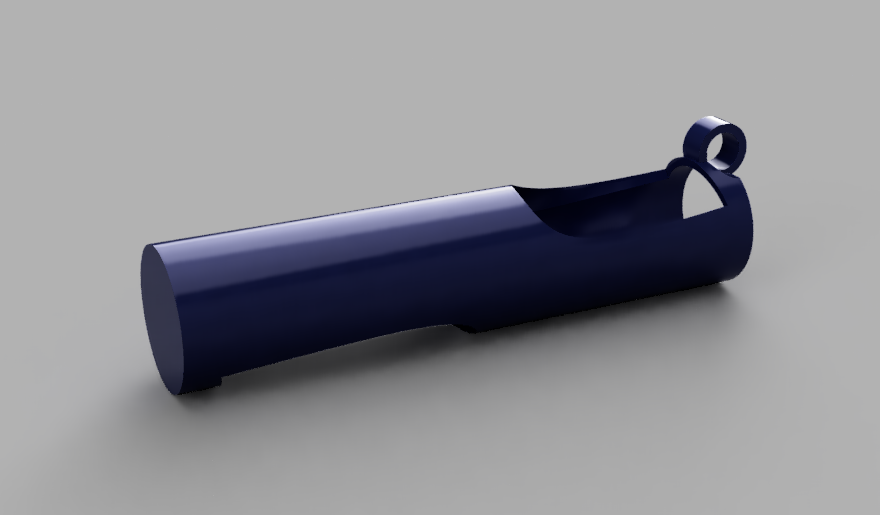

# Batom de bolso

Frase-conceito: O meu batom sempre á mão.

## Conceito

Este projeto explora a ideia de praticidade ao levar o meu batom sempre comigo independentemente com que mala ou roupa esteja a usar de momento.

## Tecnologias Usadas

Uma ou mais tecnologias estudadas em laboratório:

- [ ] Corte 2D (laser / vinil)
- [x] Impressão 3D
- [ ] CNC
- [ ] Micro:bit / computação física
- [ ] Outras —

Utilizei os filamentos da impressora em 3D e a plataforma do BambuStudio.

## Processo

A minha ideia para este processo começou quando, num momento do meu dia a dia, percebi q o meu acessório indispensável, o meu batom, acabava por ocupar demasiado espaço mesmo que em malas pequenas. Por isso, decidi aproveitar este projeto para por em prática esta mesma ideia. Passei para a modelação do Fusion, e de seguida para a preparação deste mesmo ficheiro. Assim que terminado, passei para a impressora 3D, a primeira vez não correu como planeado, a impressora encravou e os filamentos ficaram uma massada. Já a segunda tentativa correu maravilhosamente. O chaveiro acabou por ficar como tinha idealizado e bastante funcional, apenas ficou um pouco pequeno demais.
A ideia para este projeto surgiu a partir de uma situação do meu dia a dia. Percebi que um dos meus acessórios indispensáveis, o batom, acabava por ocupar demasiado espaço, mesmo quando utilizava malas mais pequenas. Por isso, decidi aproveitar este projeto para desenvolver uma solução que respondesse ao meu problema.
Comecei por idealizar o conceito e desenvolvê-lo na plataforma Fusion, criei o modelo que permitisse transportar o batom de forma simples e funcional através de um chaveiro. Após concluir a fase de modelação, preparei o ficheiro para a impressão 3D. A primeira tentativa de impressão não correu como esperado, uma vez que a impressora encravou. No entanto, a segunda impressão decorreu sem problemas e permitiu concluir a peça conforme planeado.
O resultado final correspondeu à ideia inicialmente concebida, mostrando ser um objeto funcional, prático e fiel á ideia original. Apesar disso, considero que o chaveiro ficou ligeiramente mais pequeno do que o ideal. Ainda assim, fiquei bastante satisfeita com o produto final e com a experiência adquirida ao longo de todo o processo.

## Resultado Final

Fotografia do resultado final deste projeto.

Renderização do projeto final na plataforma Fusion.

## Reflexão

Como conclusão, acredito que o resultado terminou por ficar como pretendido. No início tinha usado um batom em específico como estrutura de medidas, o resultado final ficou mais pequeno do que o suposto, o que acabou por ser usado para um outro batom em específico. Mas como resultado final, fiquei bastante satisfeita com este projeto.