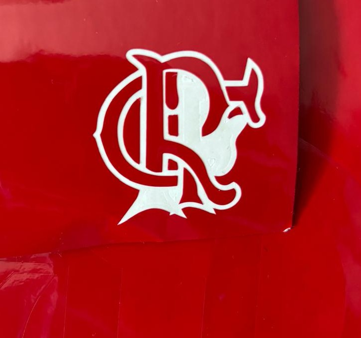
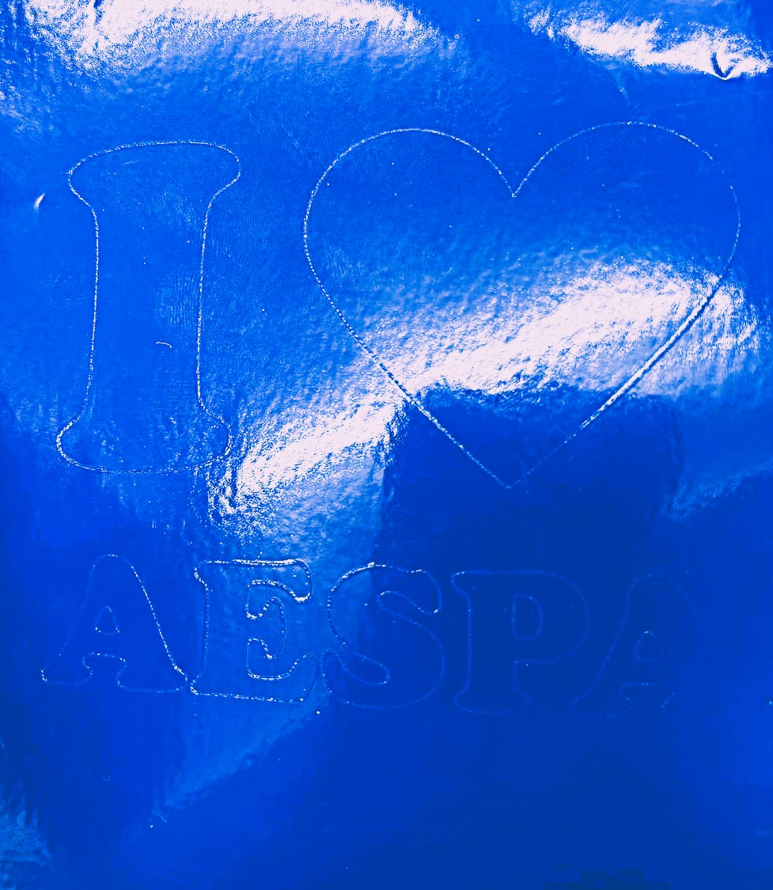
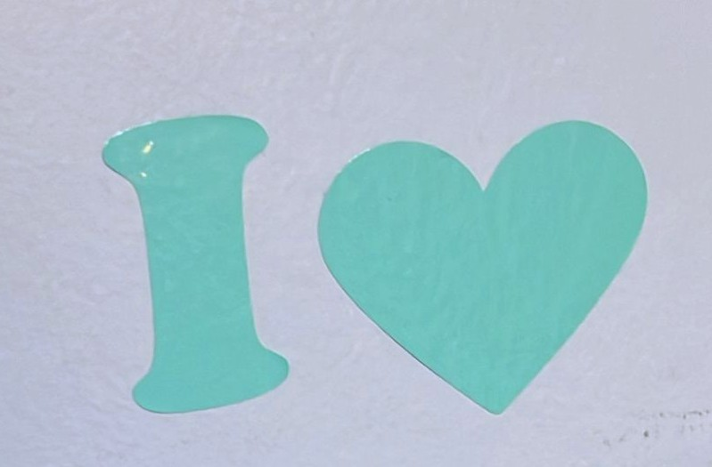

# Vinil em Design

Frase-conceito: Um autocolante em vinil concebido para transformar superfícies comuns em espaços de criatividade.

## Conceito

Este projeto explora a ideia de transformar um simples sticker/autocolante em algo que conseguimos expressar a nossa criatividade.

## Tecnologias Usadas

Uma ou mais tecnologias estudadas em laboratório:

- [x] Corte 2D (laser / vinil)
- [ ] Impressão 3D
- [ ] CNC
- [ ] Micro:bit / computação física
- [ ] Outras —

Utilizei o material dos rolos em vinil, a plataforma Illustrator da Adobe e a plataforma Silhouette Studio.

## Processo

A ideia inicial para este projeto era criar um emblema em vinil. Para isso, comecei por vetorizar e preparar o ficheiro na plataforma Adobe Illustrator, garantindo que o desenho estivesse adequado para o processo do corte. Após concluir esta etapa, selecionei as cores dos rolos em vinil que pretendia utilizar e preparei o material para a produção. De seguida, passei ao corte na máquina de corte 2D. A primeira tentativa não correu como esperado, uma vez que o design ficou demasiado pequeno, o que ficou difícil a remoção do próprio autocolante já que havia muitos detalhes finos, ficando emaranhados e colados uns nos outros. Perante este desafio, decidi alterar o design e ajustar algumas configurações da máquina. Na segunda tentativa, o processo decorreu com sucesso e o resultado acabou por corresponder às minhas expectativas. Ao longo do projeto, experimentei diferentes cores e dimensões, o que me permitiu compreender melhor a manusear estas ferramentas

### Iteração 1 — 

**O que tentei:** um design pequeno com vetores finos
**O que aprendi:** para tal design com recortes finos, necessita de ser pelo menos maior

## Resultado Final

Fotografia do resultado final após o recorte 

Projeto final já retirado do resto do vinil.

## Reflexão

Esta experiência contribuiu significativamente para a minha aprendizagem, tanto na preparação de ficheiros vetoriais como na utilização das ferramentas da própria máquina de corte em 2D, proporcionando-me um maior domínio nestas ferramentas durante este processo de produção.