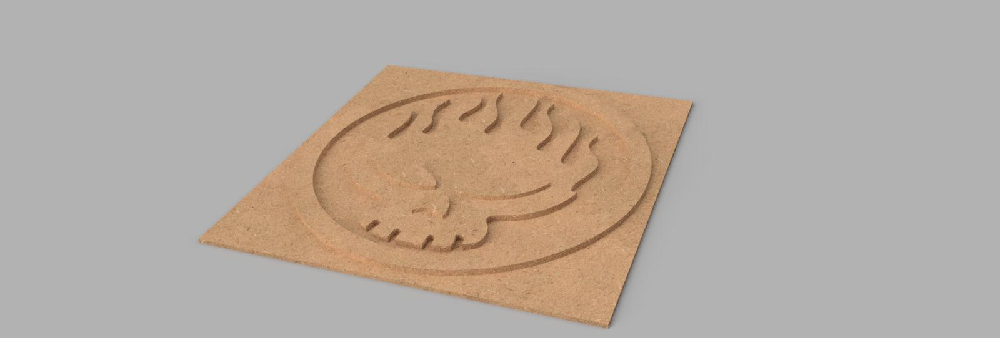
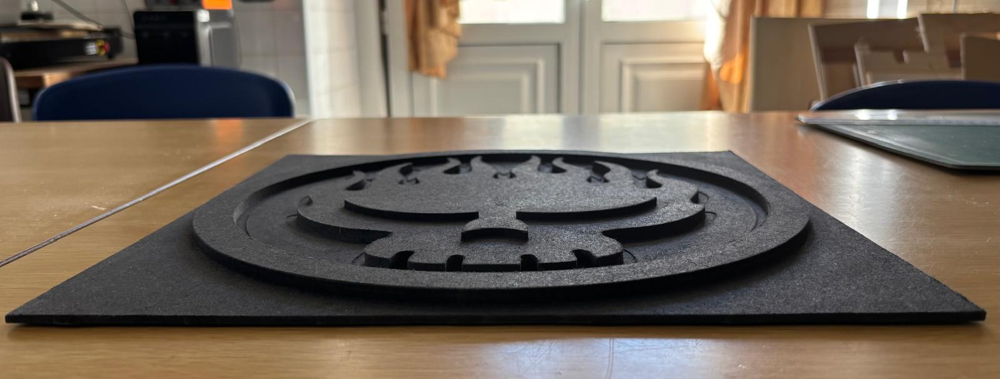

# Capa de um álbum da banda The Offspring
> Experiência detalhada
## Conceito

A ideia deste projeto surgiu a partir da minha ligação pessoal à música da banda The Offspring. Como ouço este álbum desde pequeno, achei interessante utilizar uma imagem com significado para mim e transformá-la num objeto físico. Optei por recriar o elemento central da capa do álbum Conspiracy of One, procurando adaptar o design original à tridimensionalidade que iria explorar na CNC.

## Tecnologias Usadas

- Máquina CNC
- **Materiais:** O material utilizado foi uma placa de MDF cinzenta
- **Software:** Ilustrator (para a vetorização do logo e ajuste para a fresa conseguir passar em todos os sítios) e  Autodesk Fusion (para a modelação volumétrica e paramétrica de todos os componentes)

## Processo

No inicio do projeto eu selecionei apenas o elemento central da capa do álbum _Conspiracy of One_, optando por não incluir a tipografia original devido à complexidade e às limitações do processo.

O primeiro passo consistiu na modelação do símbolo em Blender. A intenção inicial era produzir a peça através de uma abordagem tridimensional mais complexa. No entanto, durante os testes realizados, surgiram vários problemas e erros que dificultaram a obtenção do resultado pretendido.

Perante essas dificuldades, optei por uma solução diferente. A imagem foi trabalhada no Adobe Illustrator, onde converti o desenho em vetor. Esta etapa permitiu obter um maior controlo sobre as formas e adaptar alguns detalhes que eram demasiado pequenos para serem executados pela fresa da CNC, uma vez que determinadas áreas não podiam ser reproduzidas com precisão.

Depois de concluído o vetor, importei-o para o Fusion, onde o processo se tornou mais simples. A partir das linhas vetoriais, realizei a extrusão das formas, criando assim o relevo necessário para a produção da peça.

Numa fase posterior, selecionei uma placa de MDF com dimensões adequadas ao projeto e procedi à preparação do ficheiro para a maquinação em CNC. A execução permitiu materializar o modelo desenvolvido digitalmente.

Este foi um processo bastante interessante, sobretudo por ter sido a primeira vez que trabalhei com este tipo de ferramentas e tecnologias. Apesar de ter surgido um pequeno erro nas laterais da peça final, considero que o resultado obtido foi bastante positivo e fiquei satisfeito com o produto final.
### Iteração com o projeto — [título]

- **O que tentei:** Tentei recriar o elemento central da capa do álbum _Conspiracy of One_ da banda The Offspring, adaptando-o às limitações e possibilidades da tecnologia CNC.
- **O que aprendi:** Aprendi a preparar e adaptar modelos para produção em CNC, bem como a utilizar diferentes programas e a resolver problemas que surgiram durante o processo.

## Resultado Final

Render objeto no fusion.

Imagens do resultado final do projeto.

## Reflexão

- **O que faria diferente?** De forma geral, considero que o resultado final foi positivo e correspondeu ao que tinha idealizado inicialmente. No entanto, numa próxima realização, dedicaria mais tempo à fase de modelação para tentar resolver alguns dos problemas que surgiram durante o processo.

- **Que tecnologia exploraria mais a fundo numa próxima iteração?** Apesar de ter acabado por optar por outra solução devido aos vários erros encontrados, gostava de explorar mais profundamente o Blender numa futura interação. Considero que é uma ferramenta com bastante potencial e seria interessante desenvolver melhor os conhecimentos adquiridos e experimentar uma abordagem mais tridimensional aos projetos.