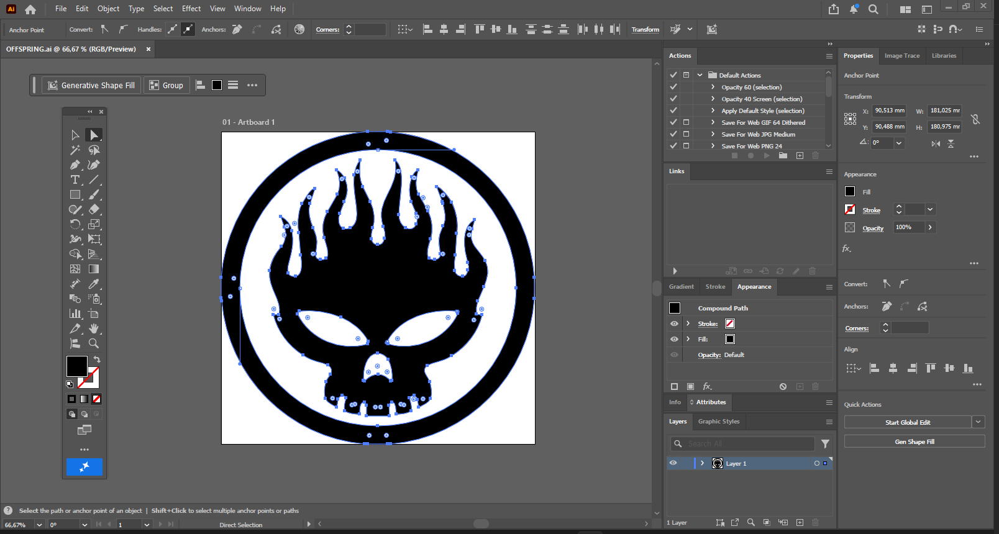
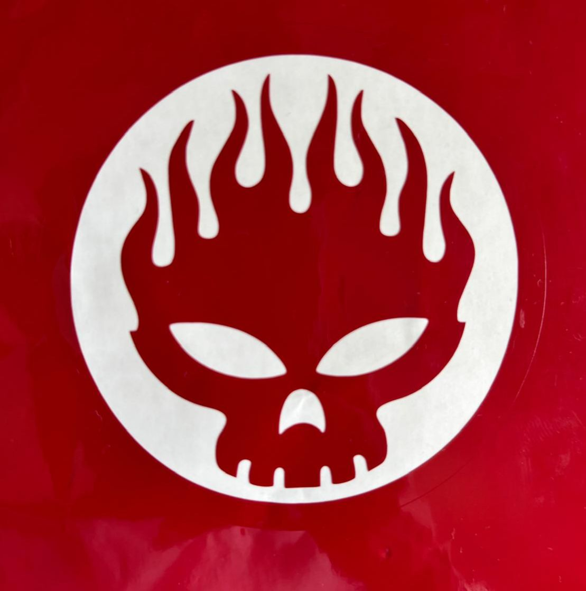

# Vinil - Offspring

Imagem de referência:

## Conceito

A ideia deste projeto foi criar um vinil autocolante inspirado no elemento central da capa do álbum _Conspiracy of One_, da banda The Offspring. Como já tinha trabalhado anteriormente com este símbolo num projeto em CNC, decidi voltar a utilizá-lo e explorar uma técnica diferente.

## Tecnologias Usadas

- Máquina Silhouette Cameo 3
- **Materiais:** O material utilizado foi o vinil
- **Software:** Ilustrator (para a vetorização do logo e ajuste para a fresa conseguir passar em todos os sítios) e Silhouette Studio (para preparar o ficheiro para ser cortado)

## Processo

Inicialmente trabalhei a imagem no Adobe Illustrator, onde procedi à sua vetorização. Este processo permitiu definir corretamente todas as linhas necessárias para o corte e preparar o desenho de forma mais precisa.

Depois de concluída a vetorização, importei o ficheiro para o Silhouette Studio, onde realizei os ajustes necessários para a máquina de corte. De seguida, selecionei o rolo de vinil pretendido e iniciei o processo de corte.

Ao contrário de alguns projetos anteriores, este trabalho decorreu de forma bastante simples e o resultado foi obtido com sucesso logo na primeira tentativa. O facto de já ter utilizado anteriormente este símbolo no projeto realizado em CNC ajudou-me a compreender melhor os detalhes da imagem e a preparar o ficheiro de forma mais eficiente.
### Iteração com o projeto — [título]

- **O que tentei:** Tentei criar um vinil autocolante a partir do elemento central da capa do álbum _Conspiracy of One_, adaptando a imagem ao processo de corte em vinil.
- **O que aprendi:** Aprendi a preparar imagens vetoriais para corte e a utilizar o Silhouette Studio para configurar corretamente o processo de produção.

## Resultado Final

Resultado final no ilustrator.

Imagens do resultado final do projeto.

## Reflexão

- **O que faria diferente?** Considero que este foi um dos projetos que correu melhor, uma vez que consegui atingir o resultado pretendido logo na primeira tentativa. O trabalho anterior realizado em CNC foi importante para facilitar esta etapa, permitindo-me aproveitar conhecimentos já adquiridos.

- **Que tecnologia exploraria mais a fundo numa próxima iteração?** Numa próxima experiência, gostaria de explorar projetos com maior complexidade e experimentar diferentes materiais e combinações de cores no vinil, de forma a desenvolver ainda mais as possibilidades desta técnica. Além disso gostava de ter feito mais stickers, o que não foi possível dado à complexidade do trabalho desenvolvido na cnc que ocupo-me grande parte do tempo.