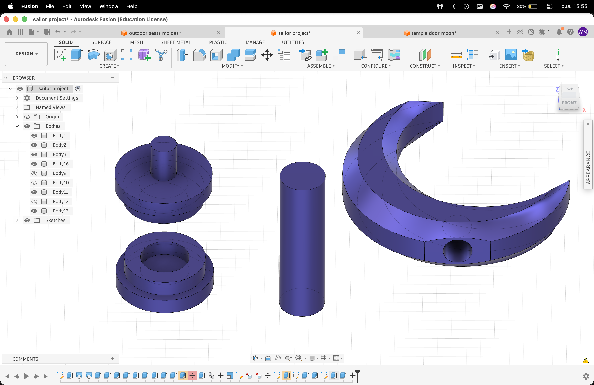
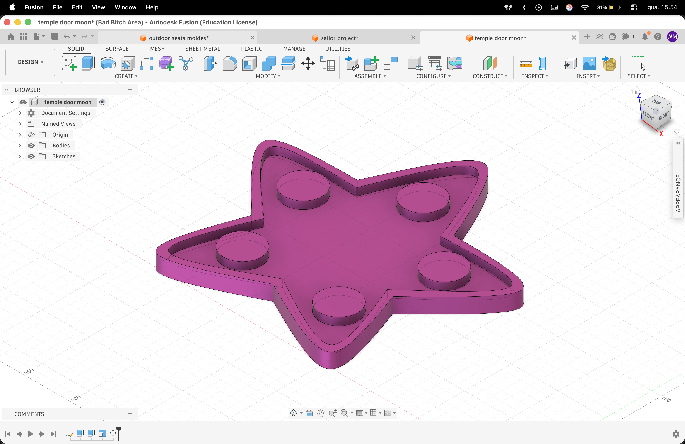

# Project Childhood
> materialização da nostalgia

## Conceito

Com este projeto escolhi representar a minha infância, perguntei-me como podia me representar de forma material e tomei isso como base. O projeto baseia-se em torno de partes da minha infância, objetos relevantes das minhas series favoritas a crescer, por isso fiz uma versão da varinha de Sailor Moon feita inteiramente por mim no Autodesk Fusion e impressa em 3d na Bambu Lab A1 Mini, bem como uma estrela, que situava-se na porta do templo de Steven Universe, essa estrela também feita inteiramente por mim no Autodesk Fusion e produzida na maquina CNC.

## Tecnologias Usadas

- Impressão 3D (FDM/FFF)
- CNC

- **Materiais:** Filamento PETG Transparente (escolhido especificamente para permitir a difusão da luz e conferir uma estética mágica e etérea ao objeto) e uma Placa de MDF.
- **Software:** Autodesk Fusion (para a modelação volumétrica e paramétrica de todos os componentes da varinha, bem como da estrela) e BambuStudio (para o fatiamento, gestão de densidade de preenchimento e configuração de suportes da varinha).

## Processo

### Iteração 1 — [Varinha]
- **O que tentei:** Dividir o modelo tridimensional em peças separadas (o cabo cilíndrico e a lua superior) para que pudessem ser impressas na orientação ideal, minimizando a necessidade de suportes e facilitando a montagem pós-impressão.
- **O que aprendi:** Ao exportar o modelo para o fatiador e realizar a primeira impressão, verifiquei um erro de cálculo nas proporções e nas tolerâncias dos encaixes (macho-fêmea), causados pela contração natural do filamento PETG ao arrefecer. Apesar de ter conseguido remediar a situação manualmente nesta fase, a experiência permitiu-me adquirir uma noção muito mais clara sobre as folgas necessárias (tolerâncias de segurança de aproximadamente 0.2mm) que devem ser projetadas na modelação de peças acopláveis.

### Iteração 1 — [Estrela]
- **O que tentei:** Fazer a estrela no Autodesk Fusion com base nas dimensões exatas da placa de MDF disponível
- **O que aprendi:** Facilitou muito mais o processo, e permitiu uma melhor exatidão no produto final, e correu tudo como esperado.

## Resultado Final

O protótipo final apresenta a varinha icónica totalmente montada à escala real, com uma estrutura sólida. O acabamento translúcido do PETG transparente reage de forma excelente à luz ambiente, capturando a essência visual do conceito original da animação. 

## Resultado Final

O protótipo final apresenta a estrela na sua de uma forma crua mas reconhecivel, depois de limado e de ter dado os retoques finais. No final foi executado e ficou como foi planeado.

## Reflexão

- **O que faria diferente?** Especificamente sobre a varinha, numa próxima iteração, redesenharia a conectividade  entre as peças. Aumentaria ligeiramente o diâmetro do cabo e planearia um sistema de encaixe por rosca, pois sinto que isto tornaria a união melhor, eliminando de forma definitiva a necessidade de recorrer a intervenções externas ou cola quente, garantindo um acabamento melhor.
- **Que tecnologia exploraria mais a fundo numa próxima iteração?** Gostaria de testar uma tecnologia de impressão diferente, nomeadamente a impressão 3D em resina (SLA), para alcançar uma transparência perfeita.