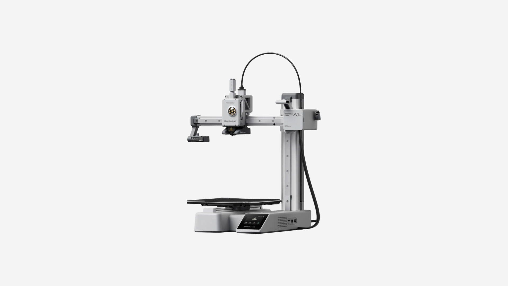

# Nome do Grupo

> Onde a criatividade encontra a tecnologia.

## Elementos do Grupo

| Número  | Nome            |
| ------- | --------------- |
| 2025290 | Wylmer Monteiro |
| 2025267 | Mafalda Ramos   |
| 2025295 | Filipe Justo    |

---

## Tutoriais de Máquinas

Cada grupo documenta **duas máquinas** com tutoriais detalhados. As páginas individuais de cada tutorial estão em tutoriais.

<!-- Cada thumbnail liga ao tutorial. Cada tutorial vive em
     tutoriais/<nome-da-maquina>/index.md (renomear `_modelo`). -->

<!-- markdownlint-disable MD033 -->

  <a class="gallery-card" href="tutoriais/bambu/">
    
    <h3>Bambu Lab A1 Mini</h3>
    
Tutorial detalhado

  </a>

  <a class="gallery-card" href="tutoriais/silhouette/">
    
    <h3>Silhouette Cameo 3</h3>
    
Tutorial detalhado

  </a>

<!-- markdownlint-enable MD033 -->

---

## Galeria de Experiências Individuais

Cada elemento do grupo desenvolveu um portfólio individual (**Projeto Integrado**, 50% da avaliação). As páginas individuais estão em experiências.

<!-- Duplicar o bloco abaixo para cada elemento e substituir `_modelo` em
     ambos os caminhos por `<numero>-<nome>`. -->

<!-- markdownlint-disable MD033 -->

  <a class="gallery-card" href="experiencias/_modelo/">
    
    <h3>Nome do Projeto</h3>
    
Nome do Aluno

  </a>

<!-- markdownlint-enable MD033 -->
