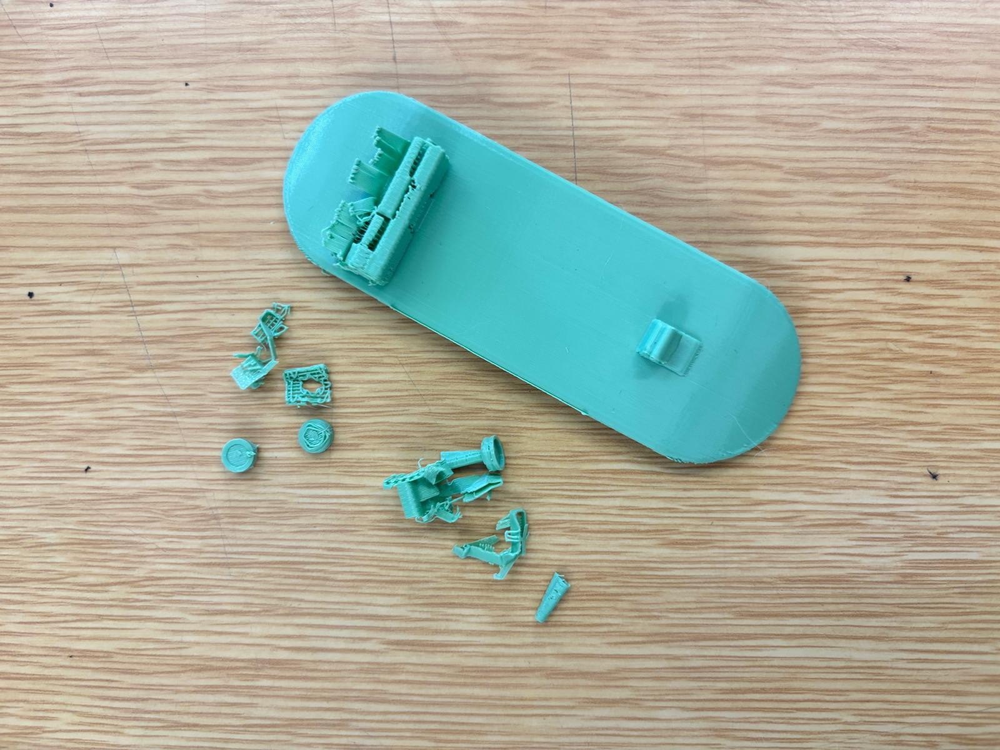
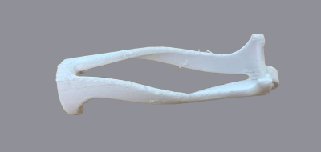

# Bambu Lab A1 Mini
> Máquina de impressão 3D (FDM) compacta e de alta velocidade, utilizada para a prototipagem rápida e materialização de modelos digitais tridimensionais.

Tutorial elaborado por Mafalda Ramos, Filipe Justo e Wylmer Monteiro, seguindo a estrutura de referência do Fablab Benfica: <https://fablabbenfica.gitlab.io/fablabbenficadocs/machines/ouplan/>

## 1. Como desenhar para esta tecnologia?

A impressão 3D por deposição de filamento (FDM) exige alguns cuidados na modelação para garantir uma impressão bem-sucedida e estruturalmente viável:
- **Paredes e espessuras:** Evitar modelar paredes demasiado finas no projeto. O bico tem um diâmetro fixo, e geometrias inferiores a esse valor não serão impressas.
- **Base de apoio:** Preferir superfícies planas para a base do objeto. Isto garante uma excelente adesão à base (bed) e permite uma construção muito mais rápida e fácil do modelo, minimizando a necessidade de suportes.

## 2. Como preparar um ficheiro para a máquina

Para que a impressora perceba o modelo 3D, este tem de passar por um processo de _slicing_ (fatiamento).

- **Software:** Bambu Studio.
- **Formatos de ficheiro:** STL ou OBJ.
- **Settings principais:**
	- Escolher a máquina correta (neste caso, a **Bambu Lab A1 Mini**) no software.
	- Definir o tipo de material/filamento a ser utilizado.
	- Ajustar os parâmetros de qualidade: altura das camadas (layer height) e densidade do preenchimento (infill).
	- Analisar a geometria e gerar os suportes que poderão vir a ser necessários para partes suspensas (overhangs).
	- Finalizar o projeto fazendo o _slice_ e exportar o ficheiro final (.gcode/.3mf) para a pen USB

## 3. Antes de Começar

### 3.1. Segurança

- **Temperaturas extremas:** Não tocar na extrusora (_nozzle_/bico) nem na base aquecida, pois encontram-se a temperaturas muito elevadas que podem causar queimaduras graves.
- **Partes móveis:** Ter cuidado para não colocar as mãos na área de impressão, para não interferir no trajeto da máquina. Uma interferência física pode causar lesões, descalibrar a impressora e forçá-la a executar movimentos fora do pretendido.

### 3.2. Que tipo de ficheiros vou usar e onde os posso produzir

Poderá produzir ficheiros tridimensionais (STL ou OBJ) em qualquer software de modelação 3D (ex: Fusion 360, Blender, SolidWorks). Estes ficheiros de malha poligonal deverão depois ser importados para o _Bambu Studio_, preparado nas impressoras da escola ou no seu computador pessoal, e transferidos por USB para operar a máquina.

## 4. Como operar a máquina passo-a-passo

1.  **Preparação da Base:** Retirar a base magnética (placa PEI) e garantir que não tem resíduos de impressões anteriores. Limpar a placa da máquina com álcool para remover oleosidades e passar uma laca específica se a superfície estiver escorregadia. Voltar a colocar a base devidamente alinhada. Isto garante que o projeto fique agarrado à base e não se desloque de um sítio para o outro durante a impressão.
2. **Inserção do Ficheiro:** Inserir a pen USB ou Cartão SD e verificar no ecrã da impressora se o ficheiro/projeto pretendido aparece na listagem. Outra opcção pode ser via App Bambu Studio se estiverem ambos dispositivos conectados na mesma rede.
3. **Gestão do Filamento:** Confirmar visualmente se existe a quantidade de filamento necessário para o projeto. Se for necessário trocar:
	- O filamento antigo deve ser aquecido e puxado devagar (através da opção _Unload_ no ecrã).
	- Colocar o novo rolo, inserir o filamento no tubo e alimentá-lo até ser agarrado pelo motor da extrusora (utilizando a opção _Load_).
4. **Iniciar a Impressão e Calibrar:** Selecionar o ficheiro no ecrã e iniciar a impressão. Garantir que a opção de calibração automática da cama (_Bed Leveling_) está selecionada. A máquina fará a purga e iniciará o trabalho.
5. **Monitorização Inicial:** Devem ser acompanhadas as primeiras camadas para ver se não acontecem erros iniciais, como o descolamento da peça ou falhas na extrusão.

## 5. Resultado e pós-produção

- **Arrefecimento:** Quando o projeto estiver terminado, deve-se esperar que a máquina e a placa arrefeçam.
- **Extração:** Pode-se dobrar ligeiramente a placa PEI flexível para soltar a peça impressa com facilidade.
- **Limpeza:** Se a peça os tiver, deve-se remover os suportes existentes manualmente ou com a ajuda de um alicate de corte.
- **Acabamento:** Se for necessário, podem-se lixar pequenas imperfeições finais para um acabamento mais liso.
### 5.1. Exemplos de Resultados

## 6. Recursos e Ficheiros

Templates, ficheiros-modelo, links, bibliografia técnica, FAQ, troubleshooting.

- Ficheiros-modelo: 

- Links externos: 
https://bambulab.com/en/download/studio
https://www.autodesk.com/education/edu-software/fusion