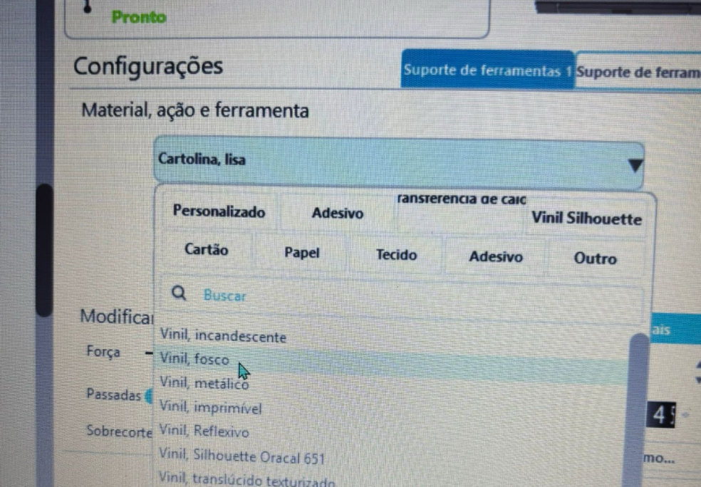
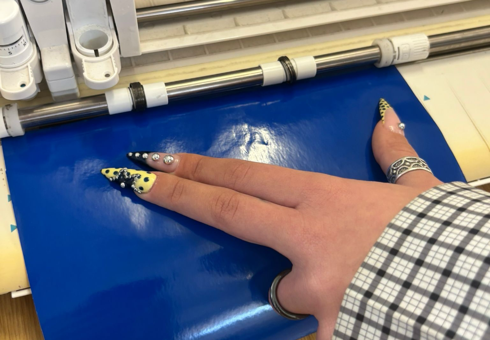
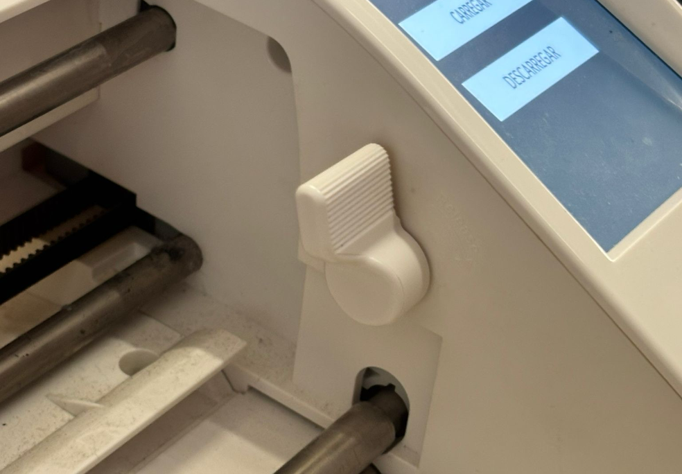

# Silhouette Cameo 3

> Plotter de corte operada por computador, ideal para recortes de alta precisão em materiais planos 2D, como vinil autocolante, papel e cartolina

Tutorial elaborado por Mafalda Ramos, Filipe Justo e Wylmer Monteiro, seguindo a estrutura de referência do Fablab Benfica: <https://fablabbenfica.gitlab.io/fablabbenficadocs/machines/ouplan/>

## 1. Como desenhar para esta tecnologia?

O processo de criação vetorial para plotters de corte baseia-se em caminhos fechados (_paths_).

- **Regras de Modelação:** O desenho deve ser, preferencialmente, feito no _Adobe Illustrator_ e convertido em contornos (Outlines).
- **Consistência:** Trabalhar o ficheiro desta forma garante que o desenho fica igual e não sofre alterações estruturais ou de fontes textuais em qualquer computador e software onde for aberto.

## 2. Como preparar um ficheiro para a máquina

A máquina interpreta apenas linhas vetoriais por onde a lâmina de corte irá passar.

- **Software:** Silhouette Studio.
- **Formatos de ficheiro:** DXF (exportado através do Illustrator).
- **Settings principais:**
    - Importar o ficheiro DXF para o espaço de trabalho no Silhouette Studio.
    - Ajustar os perfis e parâmetros adequados ao tipo de vinil a ser utilizado.
    - Definir manualmente (ou usando predefinições) a velocidade e a força/pressão de corte pretendidas.

## 3. Antes de Começar

### 3.1. Segurança

- **Operação:** Não mexer no vinil, no tapete de corte ou na área de arrasto do carro de corte durante o processo.
- **Verificações:** Verificar sempre se o vinil está bem preso na máquina e assegurar que se encontra o mais direito e perpendicular possível na lateral por onde vai ser preso, evitando encravamentos do material.

### 3.2. Que tipo de ficheiros vou usar e onde os posso produzir

Irá utilizar ficheiros bidimensionais em formato DXF. Estes podem ser criados em qualquer programa de desenho vetorial (como o Illustrator ou Inkscape) quer no seu computador em casa quer na escola, desde que não se esqueça de expandir/converter todos os traços e textos em contornos antes de exportar.

## 4. Como operar a máquina passo-a-passo

1. **Preparar o Material:** Cortar manualmente o pedaço de vinil com o tamanho desejado e suficiente para o seu ficheiro. Caso use papel ou pedaços pequenos, fixe-os no tapete de corte próprio da Silhouette.
2. **Verificar a Lâmina:** Certificar-se de que a lâmina de corte (AutoBlade) está perfeitamente trancada no carro (Suporte 1) antes de inserir qualquer material.
3. **Alinhar o Material:** Levantar a alavanca lateral de fixação dos roletes e inserir o vinil alinhado com as marcas/linhas guia no lado esquerdo da ranhura de entrada.

4. **Fixar o Material:** Baixar a alavanca para baixar os roletes, assegurando que estes ficam a prender e a fixar o vinil nas extremidades.

5. **Carregar o Vinil:** De seguida, no ecrã tátil frontal da máquina, pressionar o botão "Carregar". O material avançará até à posição inicial de corte.
6. **Iniciar o Corte:** No software Silhouette Studio, depois de enviar as definições de corte, a máquina ajustará automaticamente a lâmina com um sistema de cliques audíveis do lado esquerdo e começará a cortar.
7. **Finalizar:** Quando a máquina acabar a operação e voltar à posição zero, pressione o ecrã para descarregar o material. Por fim, pode levantar a alavanca e retirar o vinil já cortado.

## 5. Resultado e pós-produção

- Após o recorte estar concluído, a operação resulta numa folha com as formas incisas.
- **Depilação (Weeding):** Utilizar um gancho de depilação ou uma pinça para remover os espaços negativos (o vinil que não faz parte do desenho).
    
- **Transferência:** Aplicar fita de transferência (_transfer tape_) por cima do vinil restante com uma espátula, levantá-lo da película traseira e aplicá-lo na superfície final pretendida

## 6. Recursos e Ficheiros

Templates, ficheiros-modelo, links, bibliografia técnica, FAQ, troubleshooting.

- Ficheiros-modelo: 

- Links externos:
- Vídeos de referência: